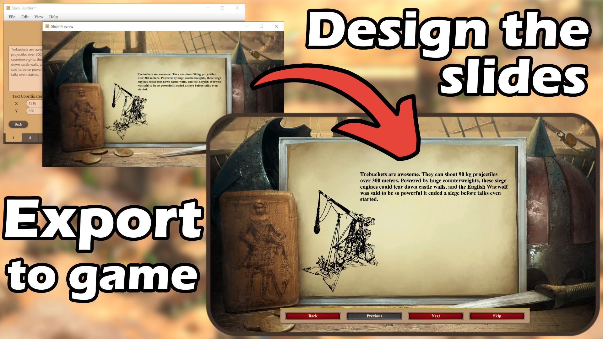

<div align="center">
   
   <h3 align="center">AoE2:DE Slide Builder</h3>
   <p align="center">
      Create in-game cutscenes effortlessly for Age of Empires II: Definitive Edition.
      <br />
      <a href="https://github.com/Jokairo/aoe2-slidebuilder/releases">🟢 Download</a>
      &middot;
      <a href="./docs/tutorial.md">📘 How to Use</a>
   </p>
</div>

## About

**Slide Builder** is a design tool that simplifies the creation of in-game cutscenes and campaign menus for **Age of Empires II: Definitive Edition**. It features a user-friendly interface for designing and previewing cutscenes, synchronizing audio with slides, and exporting the finished campaigns that are instantly usable in the game.

The tool is built with **Java** and **JavaFX**, and includes its own bundled Java runtime (Zulu JRE 1.8), so it works out-of-the-box on Windows without needing Java installed.

## Why use this?

Age of Empires II: Definitive Edition includes a powerful campaign editor, but it does not support designing **cutscenes** or **campaign menus**. Creating these features manually is a frustrating trial-and-error process.

### ❌ Problems with the current method:
- Rigid folder and file structure. The campaign will not load unless files are placed exactly where the game expects.
- No visual feedback. Text and image layout must be guessed and tested repeatedly by manually editing JSON files.
- Custom backgrounds must be in `.dds` format, requiring external tools and extra steps to convert images.
- Audio must be in `.wem` format, requiring WWise and knowledge of its export settings.

### ✅ How Slide Builder helps:
- Automatically sets up the correct folder structure.
- Visual editor with in-game-style preview.
- Intuitive drag-to-move and resize for text and images.
- Automatically converts images and audio to the correct formats.
- Built-in audio syncing for previewing and aligning narration with slide transitions.
- One-click export. Launch the game and your campaign is ready.
- No coding or JSON editing required.

## Download

1. Download the latest `.zip` from the [Releases](https://github.com/Jokairo/aoe2-slidebuilder/releases) tab.
2. Unzip the archive.
3. Launch the application by double-clicking **SlideBuilder.exe**.

## Tutorial

📘 [Step-by-step tutorial on how to use Slide Builder](./docs/tutorial.md)

##  For Developers

### Prerequisites

- [Java 8 JDK with JavaFX](https://www.azul.com/downloads/?version=java-8-lts&package=jdk-fx#zulu) (e.g., Zulu JDK-FX 8)
- (Optional) [Maven](https://maven.apache.org/download.cgi)

Make sure to set the `JAVA_HOME` environment variable.

### Clone the repository

```bash
git clone https://github.com/Jokairo/aoe2-slidebuilder.git
cd aoe2-slidebuilder
```

### Build the project

```bash
mvn clean install
# or if you don't have Maven installed
./mvnw.cmd clean install
```

### Run the application

```bash
mvn jfx:run
# or
./mvnw.cmd jfx:run
```

### Running from IDE
You can also run the project directly from an IDE such as IntelliJ IDEA:

1. **Set up SDK**
   If using Zulu JDK 8 with JavaFX, ensure your selected SDK includes:
   - `jfxswt.jar` (found in `zulu-8/jre/lib/`)
   - `jfxrt.jar` (found in `zulu-8/jre/lib/ext/`)
   These must be included in the build path (**File** > **Project Structure > SDKs** in IntelliJ IDEA).

2. **Add Run Configuration**
   Create a new run configuration and set the **Main class** to `slidebuilder.Launcher`

You should now be able to run the project from your IDE.

### Creating an executable

To package the project as both a `.jar` and a `.exe`, run:

```bash
mvn clean package
# or
./mvnw.cmd clean package
```

This will generate both `slidebuilder.jar` and `SlideBuilder.exe` inside the `target/` folder. To launch the application:
- **Windows:** Double-click `SlideBuilder.exe`
- **Any OS** (with Java 8 installed):
```bash
java -jar slidebuilder.jar
```


## Feedback & Contributions

If you find bugs or have suggestions, feel free to open an issue or submit a pull request.

## Disclaimer

Age of Empires II: Definitive Edition © Microsoft Corporation. Slide Builder was created under Microsoft's "Game Content Usage Rules" using assets from Age of Empires II: Definitive Edition, and it is not endorsed by or affiliated with Microsoft. https://www.xbox.com/en-US/developers/rules

This tool includes a bundled copy of **Zulu JRE 1.8** by Azul Systems, which is a free and redistributable OpenJDK build under the **GPLv2 with Classpath Exception** license. https://www.azul.com

## Third-Party Libraries

Slide Builder includes the following third-party libraries:

- **DDS-Utils**
https://github.com/Dahie/DDS-Utils